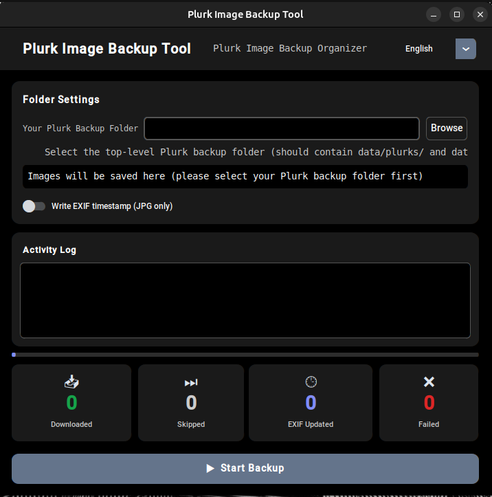

# Plurk Image Backup Tool CT — User Guide

Download and organise all images from your Plurk JS backup files into dated folders, automatically.

<!-- screenshot placeholder -->
<!-- TODO: add screenshot of the GUI here -->


---

## What it does

Plurk provides a data export feature that saves your posts and responses as JS files.
This tool reads those JS files, extracts every image URL, downloads the images, and sorts them into subfolders by date (`YYYY-MM-DD`).

It also optionally writes the original post timestamp into each JPEG's EXIF metadata, so the photos sort correctly by date in your photo library or file manager.

---

## Requirements

Just your operating system. No Python installation required.

| Platform | Supported |
|---|---|
| Windows | ✅ |
| macOS | ✅ |
| Linux (Ubuntu / Debian and others) | ✅ |

---

## Installation

### 1. Download the binary

Go to the [Releases page](https://github.com/rkwithb/Plurk-Image-Backup-Tool-CT/releases) and download the file for your platform:

| Platform | File |
|---|---|
| Windows | `plurk-backup-win.exe` |
| macOS | `plurk-backup-macos` |
| Linux | `plurk-backup-linux` |

### 2. Platform-specific setup

**Windows**

Double-click the `.exe` file to launch. If Windows SmartScreen shows a warning, click **More info → Run anyway**.

**macOS**

Because the binary is not signed with an Apple developer certificate, macOS Gatekeeper will block it on first launch.

To allow it:
1. Right-click (or Control-click) the file and select **Open**.
2. Click **Open** in the dialog that appears.

Alternatively, go to **System Settings → Privacy & Security** and click **Open Anyway** next to the blocked app entry.

You only need to do this once.

**Linux**

Make the file executable before running it:

```bash
chmod +x plurk-backup-linux
./plurk-backup-linux
```

---

## Usage

### Prepare your Plurk backup

Export your data from Plurk. Your backup folder should contain this structure:

```
your-backup-folder/
└── data/
    ├── plurks/        ← JS files for your main posts
    └── responses/     ← JS files for your replies
```

### Run the tool

1. Launch the application.
2. Click **Browse** and select your top-level backup folder (the one containing `data/`).
3. The output path will be shown automatically — images will be saved to `plurk_images_by_date/` inside your backup folder.
4. *(Optional)* Enable **Write EXIF timestamp** to embed the original post date into each JPEG file.
5. Click **▶ Start Backup**.

The tool will scan your backup files, download any new images, and display a summary when complete.

### Output structure

```
your-backup-folder/
└── plurk_images_by_date/
    ├── 2021-03-15/
    │   ├── image1.jpg
    │   └── image2.png
    ├── 2021-03-16/
    │   └── image3.gif
    └── ...
```

### Re-running the tool

Already-downloaded images are automatically skipped. It is safe to run the tool again after adding new backup files — only new images will be downloaded.

---

## License

Licensed under [Apache License 2.0](https://creativecommons.org/licenses/by-nc/4.0/) — Non-commercial use only.

> Disclaimer: Use at your own risk. The author is not responsible for any damages.
