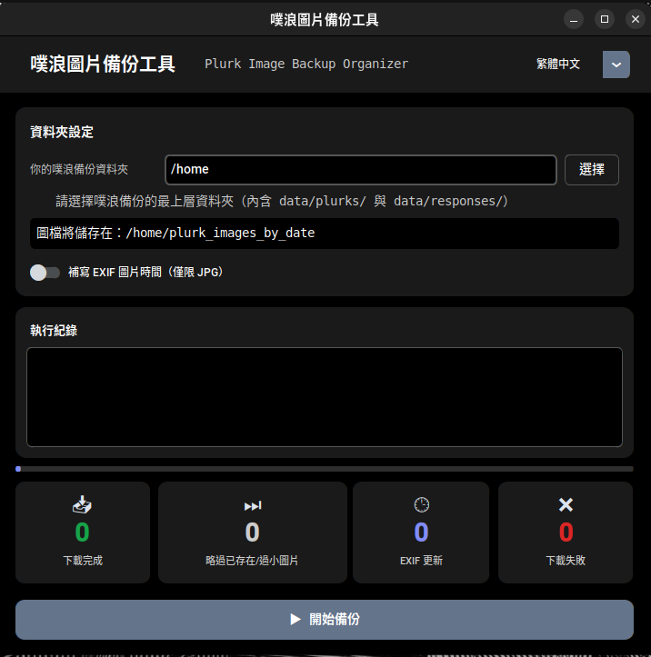

# 噗浪圖片備份工具 CT — 使用說明

自動從噗浪 JS 備份檔中下載所有圖片，並依日期整理至子資料夾。

<!-- 截圖佔位 -->
<!-- TODO: 在此新增 GUI 截圖 -->

---

## 這個工具做什麼

噗浪提供資料匯出備份功能，會將你的噗文與回應儲存為 JS 檔案。
本工具會讀取這些 JS 檔案，擷取所有圖片網址，下載圖片，並依日期（`YYYY-MM-DD`）整理至子資料夾。

此外，也可選擇將原始噗文的發文時間寫入 JPEG 圖片的 EXIF 資料，讓圖片在相簿或檔案管理員中依日期正確排序。

---

## 系統需求

只需要你的作業系統，不需安裝 Python。

| 平台 | 支援狀況 |
|---|---|
| Windows | ✅ |
| macOS | ✅ |
| Linux（Ubuntu / Debian 及其他） | ✅ |

---

## 安裝方式

### 1. 下載執行檔

前往 [Releases 頁面](https://github.com/rkwithb/Plurk-Image-Backup-Tool-CT/releases)，依個人平台下載對應檔案：

| 平台 | 檔案 |
|---|---|
| Windows | `plurk-backup-win.exe` |
| macOS | `plurk-backup-macos` |
| Linux | `plurk-backup-linux` |

### 2. 各平台設定

**Windows**

直接雙擊 `.exe` 檔案即可啟動。若 Windows SmartScreen 顯示警告，請點選「**更多資訊 → 仍要執行**」。

**macOS**

由於執行檔未經 Apple 開發者憑證簽署，macOS Gatekeeper 在第一次執行時會封鎖它。

解除方式：
1. 在檔案上按右鍵（或 Control + 點按），選擇「**打開**」。
2. 在出現的對話框中點選「**打開**」。

或者，前往「**系統設定 → 隱私權與安全性**」，在遭封鎖的應用程式旁點選「**仍要打開**」。

只需執行一次即可。

**Linux**

執行前需先賦予執行權限：

```bash
chmod +x plurk-backup-linux
./plurk-backup-linux
```

---

## 使用方式

### 準備你的噗浪備份

從噗浪匯出資料後，備份資料夾應包含以下結構：

```
你的備份資料夾/
└── data/
    ├── plurks/        ← 主噗的 JS 檔案
    └── responses/     ← 回應的 JS 檔案
```

### 執行工具

1. 啟動應用程式。
2. 點選「**選擇**」，選取你的備份最上層資料夾（包含 `data/` 的那個資料夾）。
3. 輸出路徑會自動顯示，圖片將儲存至備份資料夾內的 `plurk_images_by_date/`。
4. *（選用）* 啟用「**補寫 EXIF 圖片時間**」，可將原始發噗日期寫入每張 JPEG 圖片的檔案資訊中。
5. 點選「**▶ 開始備份**」。

工具會掃描備份檔案、下載新圖片，並在完成後顯示統計結果。

### 輸出結構

```
你的備份資料夾/
└── plurk_images_by_date/
    ├── 2021-03-15/
    │   ├── image1.jpg
    │   └── image2.png
    ├── 2021-03-16/
    │   └── image3.gif
    └── ...
```

### 重複執行

同一個備份資料夾裡已下載的圖片會自動略過，可以安心地在新增備份檔案後再次執行，只會下載新圖片。

---

## 授權條款

本專案採用 [CC BY-NC 4.0](https://creativecommons.org/licenses/by-nc/4.0/) 授權，僅限非商業使用。

> 免責聲明：使用風險自負，作者不對任何損失負責。
